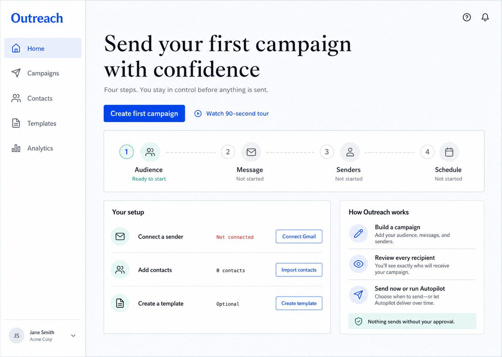
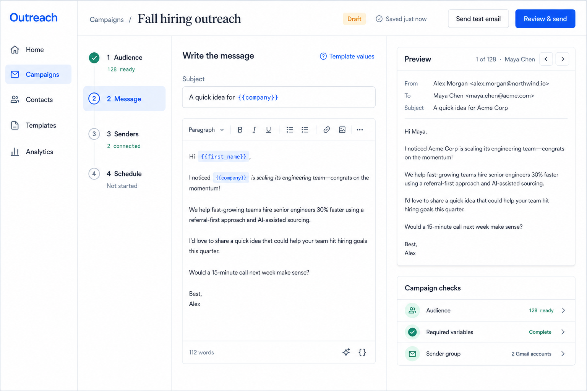
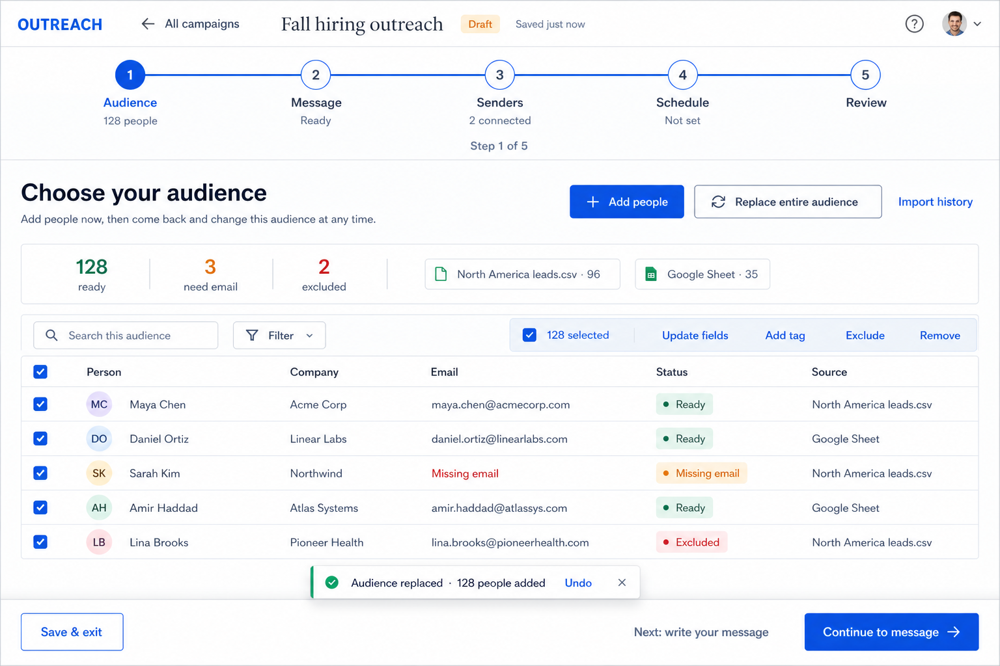
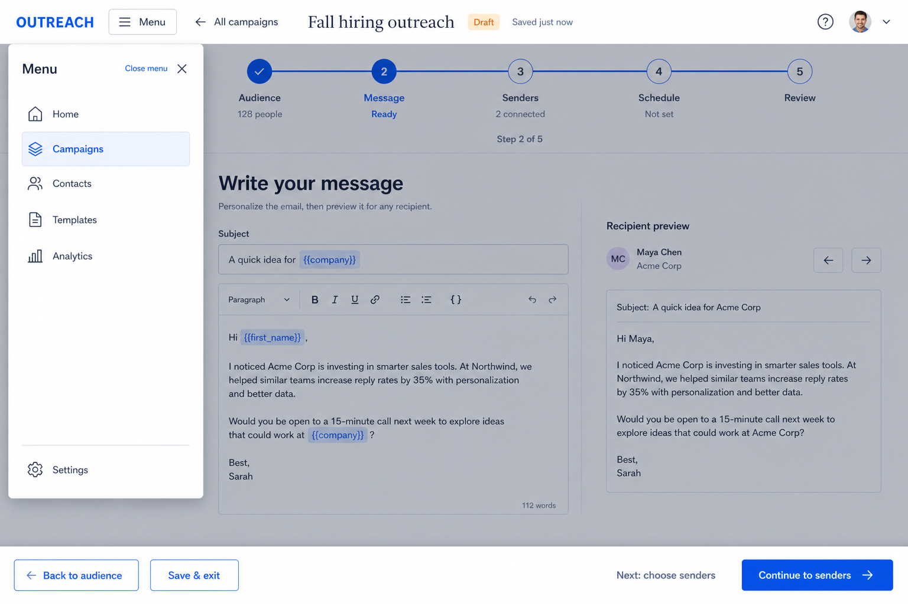
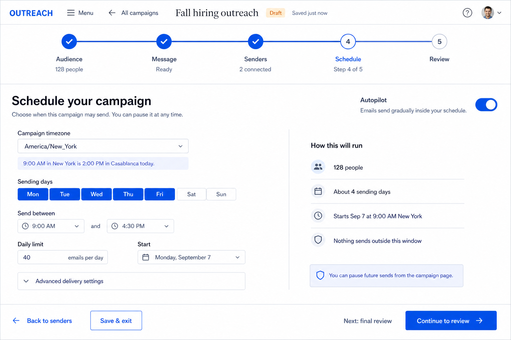
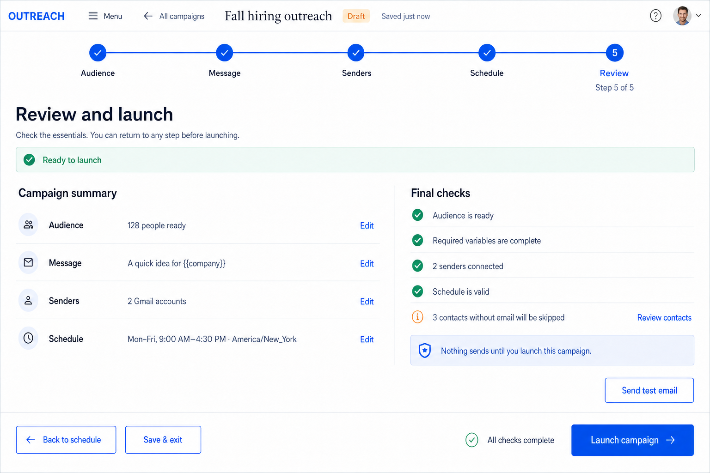
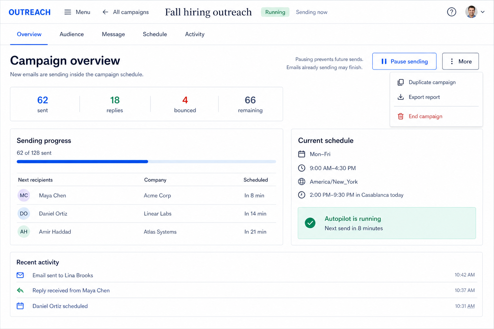
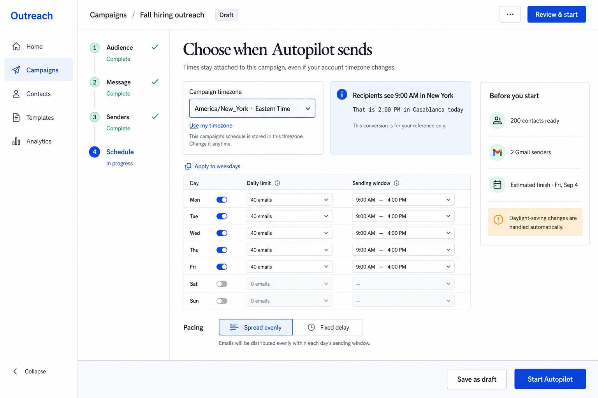

# Outreach product redesign direction

These concepts reorganize Outreach around the task users are actually trying to finish:

1. Choose an audience.
2. Write the message.
3. Choose the senders.
4. Decide when to send.

## Onboarding model

Do not make a mandatory product tour the main onboarding experience. A tour explains the interface before the user has a reason to remember it.

Use a guided first campaign instead:

- The first home screen has one primary action: **Create first campaign**.
- A persistent four-step flight-plan shows the whole workflow and the current step.
- Each step teaches only the controls needed at that moment.
- An optional 90-second tour remains available and can always be skipped.
- The interface prevents accidental sending and repeats the promise: **Nothing sends without your approval.**
- After the first campaign, the home screen can become an operational view of active campaigns, upcoming sends, and issues that need attention.

## Campaign builder

The campaign editor should use the same four-step model. Keep the composer and recipient preview visible together, while moving setup state into a compact step rail and campaign-check panel.

## Unified campaign workspace (preferred direction)

The refined builder removes the competing application sidebar and vertical wizard rail. While a campaign is open, one horizontal flight path becomes the navigation for the workflow.

- Every step remains clickable, including completed steps, so users can return and change earlier decisions.
- Each screen reveals only the tools needed for its current step.
- The Audience step supports adding another source, selecting many people for bulk updates, and replacing the entire audience.
- Replacing an audience keeps the campaign message, senders, and schedule intact, requires confirmation, and provides a short undo window.
- **Save & exit** returns to the broader application; the full application navigation does not compete with the wizard.

## Extended campaign flow

The broader flow keeps the same focused shell while changing only the content needed for the current job.

### Message and temporary application menu

The application menu is hidden by default inside the wizard. A labeled **Menu** control opens it as a dismissible overlay without shifting or restructuring the campaign workspace.

### Schedule and Autopilot

The schedule shows the campaign timezone and the viewer's current local conversion together. Core controls remain visible; advanced delivery settings stay collapsed until requested.

### Review and launch

Review summarizes only launch-critical information. Each section links back to its source step, warnings remain actionable, and there is one primary launch action.

### Running campaign

After launch, the setup wizard becomes an operational campaign view. **Pause sending** is prominent and reversible, while **End campaign** remains a separate destructive action in the secondary menu.

## Campaign timezone model

Timezone belongs to the campaign, not only to the account.

- The account timezone is the default for new campaigns.
- Each campaign stores its own IANA timezone, such as `Africa/Casablanca` or `America/New_York`.
- Weekly Autopilot windows are interpreted in the campaign timezone.
- Concrete delivery timestamps are normalized to UTC for storage and worker execution.
- The UI shows the viewer's local conversion as reference text; it does not silently rewrite the campaign's wall-clock schedule.
- Daylight-saving transitions are handled by the timezone database.

Example: a campaign configured for `09:00` in `America/New_York` remains a 9 AM New York campaign. A user in Casablanca sees the current Casablanca equivalent beside it.

## Visual system

- **Ink:** `#17212B`
- **Paper:** `#F7F9FC`
- **Cobalt:** `#2457E6`
- **Mint:** `#C8F5E6`
- **Amber:** `#F0A23A`
- **Border:** `#DCE4EE`
- Use a restrained editorial serif only for welcoming or campaign-level headings.
- Use a humanist sans for controls and body text, with tabular or monospaced figures for times and counts.
- Keep motion limited to state transitions and step completion, with reduced-motion support.
